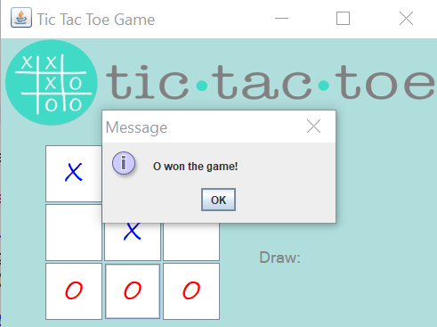

# Tic-tac-toe
It's a game for two players, X and O, who take turns marking the spaces in a 3×3 grid.
The player who succeeds in placing three of their marks in a horizontal, vertical, or diagonal row wins the game.

The players would have the option to play the game again, by a "restart" button.
They can see their scores.

